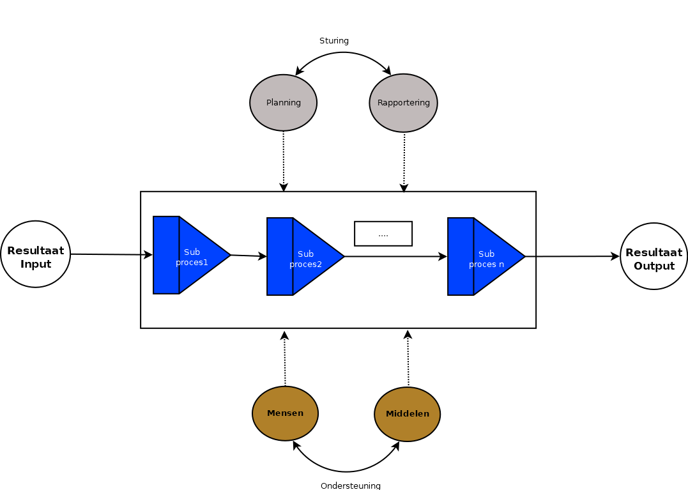
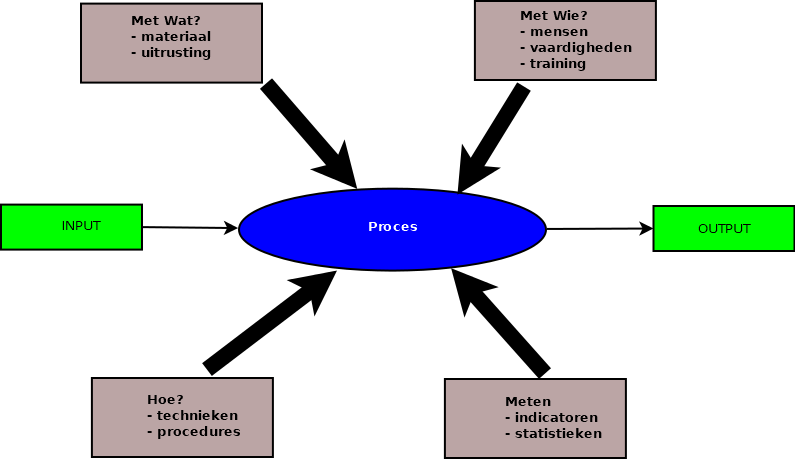
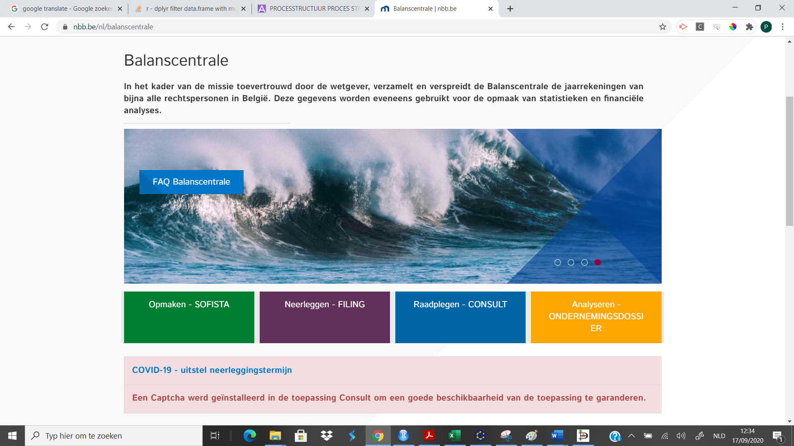
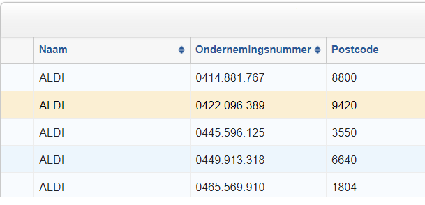
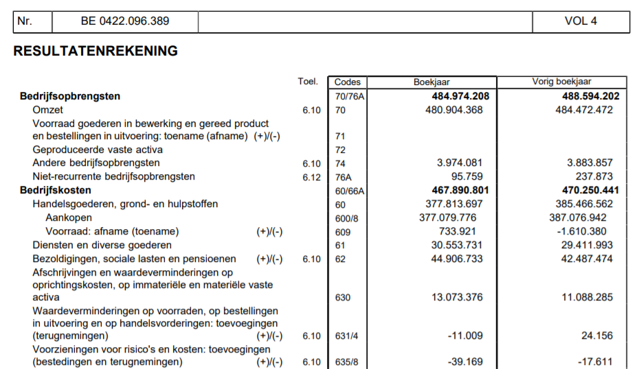
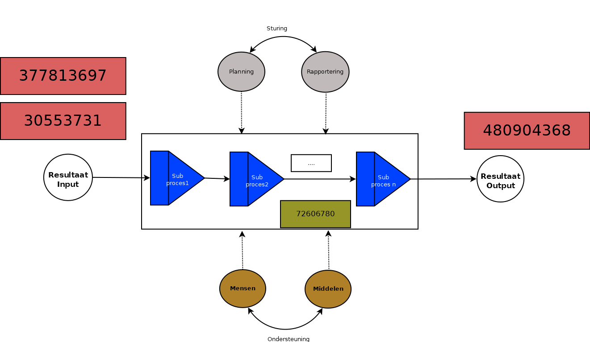
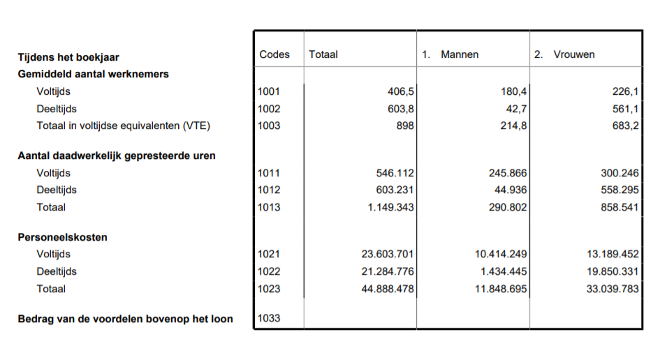

# Processen

## Wat is een (bedrijfs)proces?


Bedrijfsprocessen zijn ketens van activiteiten in de organisatie. Deze activiteiten zijn op één of andere manier geordend en gericht op het bereiken van resultaten (output) voor een klant.

Een bedrijfsproces is opgebouwd uit vijf elementen:

- resultaten
- activiteiten
- mensen
- middelen 
- sturing


```{r, echo=FALSE, out.width="90%", fig.cap=" Bouwstenen proces"}

```


Resultaten zijn opgedeeld in Input en Output. Een proces moet de juiste output  leveren. Hieronder verstaan we een product of een dienst dat aan de kwaliteitsvoorschriften en de wensen van de klant voldoet. Bovendien moet een proces zodanig ontworpen zijn dat het eindresultaat efficiënt en effectief wordt gerealiseerd. 

Veelal wordt een proces opgedeeld in subprocessen

In de rechthoek staan de (sub)processen die nodig zijn om dit resultaat te bereiken. Buiten de rechthoek hebben we de elementen getekend die processen ondersteunen. Dat zijn enerzijds de productiefactoren mensen en middelen (machines, uitrusting) en anderzijds de sturing door het management. Sturing omvat elementen als planning, rapportering, opvolging,...


De inputs zijn de grondstoffen of de diensten die nodig zijn om het proces op te starten.

Het is de verantwoordelijkheid van het management dat een proces **effectief** en **efficiënt** verloopt. Effectief wil zeggen dat het eindresultaat wordt bereikt (de output), Efficiënt wil zeggen dat dit gebeurt met een juiste inzet van mensen en middelen.

## Ontwerp van een proces

Uiteindelijk zijn het de eindresultaten die tellen. Een proces wordt doorgaans ontworpen van achter naar voren. We stellen eerst de vraag: welke resultaten willen we behalen? Vervolgens brengen we de (proces)stappen in kaart die tot dit resultaat zullen leiden. Relevante vragen hierbij zijn:

- wie voert elke specifieke activiteit van het proces uit?
- welke competenties zijn er vereist  voor elke activiteit?
- zijn er specifieke bedrijfsregels of regels eigen aan de organisatie waarmee moet rekening gehouden worden?
- wat zijn mogelijke knelpunten of fouten die kunnen gebeuren?
- welke uitrusting is er nodig?
- welke inputs (grondstoffen, materialen, contracten, informatie,  data, ...) moeten er worden voorzien
- welke metingen, controles en rapporteringen zijn nodig om het proces op te volgen?
- ....

Deze vragen kunnen gekoppeld aan onderstaande figuur

```{r, echo=FALSE, out.width="90%", fig.cap="Aandachtspunten procesontwerp"}

```


## Concreet voorbeeld

Laat ons eens kijken naar een bakkerij. Een bakker bakt brood. Dat is de output, het (eind)resultaat. Dat brood moet aan bepaalde kwaliteitseisen voldoen, anders haakt de klant af. Niet teveel zout, niet aangebrand, mooie vorm enz... De input zijn de grondstoffen (meel, bloem, water, gist, pitten, zout,...) en de diensten (brandverzekering, onderhoudscontract,....). Het proces zelf bestaat uit een keten van subprocessen, zoals:

- oven gebruiksklaar maken (reinigen, op temperatuur brengen)
- ingrediënten toevoegen
- mengen en kneden
- bakken
- afkoelen
- in rekken leggen


De mensen zijn diegene die het brood bakt en de winkelbediende. Middelen zijn de bakoven en het mengapparaat. 


Waar vind je dat allemaal terug in de boekhouding?

- het brood is omzet (klasse 70)
- grondstoffen en diensten vind je in de klasse 60 en 61
- mensen vind je onder personeelskost (62) en middelen bij de afschrijvingen


De ingezette middelen vind je terug in de balans 

Efficiënt betekent dat niet meer mensen en middelen worden ingezet dan nodig om het brood te bakken volgens de kwaliteitseisen. Effectief betekent dat het juiste brood uit de oven komt (zie hoger)


## We duiken een jaarrekening in

Op de site van de Nationale Bank van België vind je de jaarrekeningen van alle ondernemingen die verplicht een jaarrekening moeten neerleggen. (https://www.nbb.be/nl).


Klik de rubriek balanscentrale aan en vervolgens raadplegen - consult . 


```{r, echo=FALSE, out.width="90%", fig.cap="Balanscentrale"}

```


Typ "Aldi" in en selecteer het ondernemingsnummer 0422.096.389. Download als pdf de  jaarrekening met afsluitingsdatum 31/12/2019.

```{r, echo=FALSE, out.width="90%", fig.cap="Aldi"}

```


Open de download. Op pagina 8 vind je de omzet (output) en de input (klasse 60 en 61). Je vindt ook de personeelskost terug en de afschrijvingen.


```{r, echo=FALSE, out.width="90%", fig.cap="Resultatenrekening - fragment"}

```


Processen vind je uiteraard niet terug in de jaarrekening, we vinden wel de totale bedragen, het resultaat van alle processen en subprocessen. De bedragen zijn toegevoegd in onderstaande figuur:


```{r, echo=FALSE, out.width="90%", fig.cap="Bedragen"}

```

Door de processen wordt 72,6 miljoen euro aan waarde toegevoegd (output - input)

Om de efficiëntie te beoordelen van dit Aldi filiaal, raadplegen we de sociale balans op pagina 45.


```{r, echo=FALSE, out.width="90%", fig.cap="Resultatenrekening - fragment"}

```


We zien dat er 898 voltijds equivalente werknemers (VTE) zijn , en er werden 1149343 uren gepresteerd. We berekenen de waarde die de processen hebben toegevoegd per VTE:


$$\dfrac{72536940}{898}=80776,10$$


Per werknemer (uitgedrukt in VTE) brengen de processen  in dit bedrijf een waarde voort van 80776,10 euro. Is dat veel of weinig? Zo dadelijk meer hierover.


Als we de waarde van het geheel van de processen uitdrukken per gewerkt uur, dan blijkt dat er per uur 63.11 euro aan waarde wordt gecreëerd. Ook hier de vraag is dat veel of weinig?

$$\dfrac{72536940}{1149343}=63.11$$

## Oefening


Zijn deze resultaten inzake efficiëntie goed? Om dat te beoordelen moet je de berekeningen vergelijken met jaarrekeningen van andere grootwarenhuisketens. Download er enkele en vergelijk


- Bereken de waarde die de processen toevoegen in deze grootwarenhuizen 
- Beoordeel de efficiëntie door bovenstaande berekeningen te maken (proceswaarde per VTE en per gewerkt uur).

Bovendien is het nuttig om de evolutie van de efficiëntie van eenzelfde onderneming te beoordelen. Dat kan je doen door de berekeningen over verschillende jaren te maken. Verbeteren of verslechteren de cijfers? Of blijven de resultaten eerder stabiel? 


