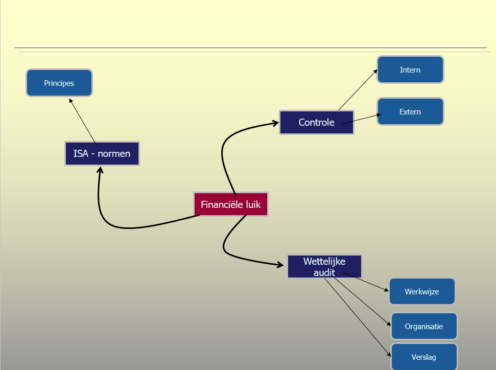

--- 
title: "Bedrijfsprocessen"
author: "Patrick Uytterhoeven"
date: "`r Sys.Date()`"
site: bookdown::bookdown_site
output: bookdown::gitbook
documentclass: book
bibliography: [book.bib, packages.bib]
biblio-style: apalike
link-citations: yes
github-repo: rstudio/bookdown-demo
description: "Dit is het handboek dat gebruikt wordt in het olod bedrijfsprocessen, graduaat Accounting and Administration, AP - hogeschool - Antwerp"
bookdown::pdf_book:
  keep_tex: true
---


# Inleiding


```{r echo=FALSE, out.width='90%'}

```


In dit document vind je het cursusmateriaal voor het olod **Bedrijfsprocessen** gedoceerd in het olod (opleidingsonderdeel) Bedrijfsprocessen, richting **Graduaat accounting administration**, AP - Hogeschool.

Het olod Bedrijfsprocessen behandelt de bedrijfsprocessen in een (kleine) onderneming. In een onderneming worden samenhangende activiteiten gegroepeerd in processen. In dit olod verwerf je inzicht in de samenstellende componenten van een (bedrijfs)proces. Je leert ook met behulp van software hoe je een bedrijfsproces kan uittekenen. Ontwerpen van processen kan een belangrijk hulpmiddel zijn om de rendabiliteit van de organisatie onder controle te hebben, en daarmee samenhangend, de efficiëntie en effectiviteit van de organisatie. Kleinere bedrijven schrijven de processen doorgaans niet uit, maar werken wel volgens bepaalde gestructureerde patronen van activiteiten. In middelgrote en grote bedrijven worden processen wel uitgetekend. Hoe groter de organisatie, hoe moeilijker de communicatie, en dan ontstaat er de behoefte om de manier waarop activiteiten verlopen te standaardiseren en overzichtelijk te maken. Het uittekenen van processen is daar een belangrijk onderdeel van.

Verder beoogt het olod de studenten inzicht te laten verwerven in de bouwstenen van een organisatie, meer bepaald een onderneming. Volgende elementen komen uitgebreid aan bod:

- ondernemingsvormen
- het begrip *management*
- het beslissingsproces
- organisatie
- teamwork en motivatie
- strategisch management
- operationeel management
- inkoop- en verkoopmanagement
- financieel management
- interne controle
- ethisch en maatschappelijk verantwoord ondernemen

Dit handboek wordt opgebouwd in de loop van het olod. Nieuwe hoofdstukken zullen toegevoegd worden in de loop van het traject.

Het operationele luik zoals hierboven beschreven, is samengevat in onderstaande mindmap. De mindmap geeft de belangrijfste accenten weer van het eerste deel van de cursustekst.


```{r echo=FALSE, out.width='90%'}

```

De operationele werking en organisatie komen uitgebreid in dit olod aan bod. Een financieel deskundige moet ervoor zorgen dat hij/zij inzicht heeft in de samenhang tussen de operationele en de financiële werking van de organisatie. De resultaten van een organisatie (winst of verlies) worden immers in hoge mate beïnvloed door de operationele werking van de organisatie.  In dit olod wordt daarom gedetailleerd ingegaan op  hoe het financiële luik en het operationele kader met elkaar in verband staan.

Omdat in de richting GAA het accent ligt op financiële en administratieve aspecten, wordt in een apart onderdeel ingegaan op de financiële audit, meer bepaald op de wijze waarop een wettelijke auditor (commissaris in het België genoemd) een audit uitvoert en het wettelijk kader in dat verband. 

België keurde in april 2010 de norm goed inzake de toepassing van de internationale controlestandaarden (ISA's) zoals uitgevaardigd door de International Auditing and Assurance Standards Board (IAASB), en dit met ingang van boekjaren afsluitend vanaf 15 december 2012 voor organisaties van openbaar belang en met ingang van boekjaren afsluitend vanaf 15 december 2014 voor de overige entiteiten. We behandelen daarom de basisprincipes van de ISA - normen, die het wettelijk kader vormen waarbinnen een commissaris - revisor / wettelijke auditor de controle van de jaarrekening uitvoert. 

De belangrijkste elementen van het financiële onderdeel die in het olod bedrijfsprocessen behandeld worden, staan in onderstaande mindmap. 

```{r echo=FALSE, out.width='90%'}

```


Deze tekst wordt aangevuld met presentaties en filmateriaal. De link is doorgaans opgenomen in deze tekst op bevindt zich op het leerplatform.
